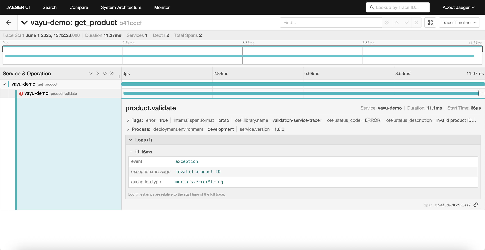
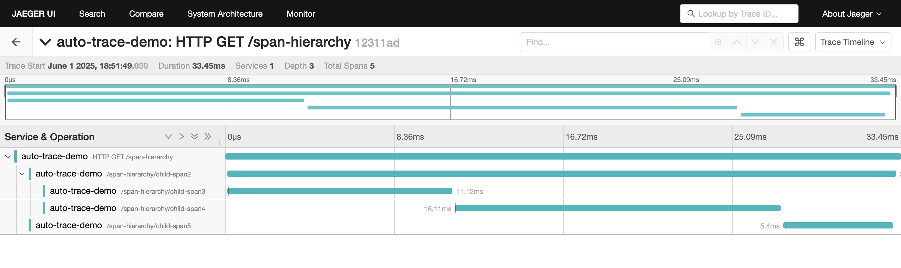

# Vayu OpenTelemetry Integration

This package provides a focused OpenTelemetry tracing integration for the [Vayu web framework](https://github.com/kaushiksamanta/vayu), enabling distributed tracing and enhanced observability for your applications.

## Features

- **Distributed Tracing**: Automatically trace HTTP requests and create child spans for operations
- **Automatic Middleware**: One-line setup for end-to-end request tracing
- **Zero OpenTelemetry Imports**: End users don't need to import any OpenTelemetry packages directly
- **Fluent API**: Chainable methods for span operations (attributes, events, errors)
- **Minimal Configuration**: Simple API with sensible defaults
- **Modular Code Structure**: Well-organized code split into focused files
- **Compatible with all OpenTelemetry backends**: Works with Jaeger, Zipkin, and any OpenTelemetry collector

## Screenshots

View your distributed traces in Jaeger UI or any other OpenTelemetry-compatible visualization tool:



Detailed view of spans with timing and attributes:



## Installation

To use the OpenTelemetry integration with Vayu, first install both packages:

```bash
go get github.com/kaushiksamanta/vayu
go get github.com/kaushiksamanta/vayu-otel
```

## Quick Start

The following example shows how to set up automatic tracing with just a few lines of code:

```go
package main

import (
	"context"
	"log"
	"net/http"
	"time"

	"github.com/kaushiksamanta/vayu"
	vayuOtel "github.com/kaushiksamanta/vayu-otel"
)

func main() {
	// Create a new Vayu app
	app := vayu.New()

	// Set up OpenTelemetry with automatic tracing in one line
	// This automatically adds the tracing middleware to the app
	integration, err := vayuOtel.TraceAllRequests(app, "my-service")
	if err != nil {
		log.Fatalf("Failed to initialize OpenTelemetry: %v", err)
	}

	// Ensure graceful shutdown
	defer func() {
		ctx, cancel := context.WithTimeout(context.Background(), 5*time.Second)
		defer cancel()
		if err := integration.Shutdown(ctx); err != nil {
			log.Printf("Error shutting down OpenTelemetry: %v", err)
		}
	}()

	// Add other middleware if needed
	app.Use(vayu.Logger())
	app.Use(vayu.Recovery())

	// Simple home route - automatically traced by the middleware
	app.GET("/", func(c *vayu.Context, next vayu.NextFunc) {
		// The request is already being traced by the middleware
		c.JSON(http.StatusOK, map[string]string{
			"message": "Hello, World!",
		})
	})

	// Route with child span for more detailed tracing
	app.GET("/users/:id", func(c *vayu.Context, next vayu.NextFunc) {
		// Get user ID from route params
		userID := c.Params["id"]
		if userID == "" {
			userID = "default"
		}

		// The parent span is already created by the middleware
		// We can create a child span for the database operation
		// Get the current context which contains the parent span
		ctx := c.Request.Context()

		// Create a child span for database operation directly from the context
		// This is simpler in auto-tracing scenarios - no need to get a tracer explicitly
		dbSpan := vayuOtel.Start(ctx, "database.get_user")
		// Add attributes using the map style API
		dbSpan.AddAttributes(map[string]interface{}{
			"db.operation": "get_user",
			"db.user_id":   userID,
		})
		defer dbSpan.End()

		// Simulate database query
		time.Sleep(50 * time.Millisecond)

		// Return the response
		c.JSON(http.StatusOK, map[string]string{
			"id":    userID,
			"name":  "User " + userID,
			"email": "user" + userID + "@example.com",
		})
	})

	// Route that demonstrates error handling with auto-tracing
	app.GET("/error", func(c *vayu.Context, next vayu.NextFunc) {
		ctx := c.Request.Context()

		// Create a span for the operation that will have an error
		errorSpan := vayuOtel.Start(ctx, "/error-example/operation")
		// Add attributes using the map style API
		errorSpan.AddAttributes(map[string]interface{}{
			"operation.type": "error-demo",
		})
		defer errorSpan.End()

		// Simulate an error
		err := errors.New("something went wrong")

		// Record the error on the span using the fluent API
		errorSpan.RecordError(err)

		// The middleware will also automatically mark the parent span as error
		// based on the HTTP status code
		c.JSON(http.StatusInternalServerError, map[string]string{
			"error": err.Error(),
		})
	})

	app.Listen(":8080")
}
```

## Configuration

```go
// Default configuration with customizations
config := vayuOtel.DefaultConfig()
config.ServiceName = "my-service"        // Required: Name of your service
config.OTLPEndpoint = "collector:4317"  // Optional: OTLP endpoint
config.UseStdout = true                 // Optional: Print traces to stdout
config.Insecure = true                  // Optional: Use insecure connection
```

## Working with OpenTelemetry Exporters

### Jaeger

```go
config := vayuOtel.DefaultConfig()
config.ServiceName = "my-service"
config.OTLPEndpoint = "jaeger:4317" // Jaeger OTLP endpoint
config.Insecure = true
```

### Custom OTLP Endpoint

```go
config := vayuOtel.DefaultConfig()
config.ServiceName = "my-service"
config.OTLPEndpoint = "custom-collector:4317" // Custom OTLP endpoint
config.Insecure = true
```

## Development & Testing

### Local Development

```go
// For local development with stdout
config := vayuOtel.DefaultConfig()
config.ServiceName = "my-service"
config.UseStdout = true // Print traces to stdout

// OR for local Jaeger
config := vayuOtel.DefaultConfig()
config.ServiceName = "my-service"
config.OTLPEndpoint = "localhost:4317" // Jaeger OTLP endpoint
config.Insecure = true // Don't use TLS for local development
```

Start Jaeger with Docker Compose:

```bash
docker-compose up -d
```

View traces at http://localhost:16686

## API Examples

### Creating Span Hierarchies

Create complex span hierarchies for detailed tracing:

```go
// Create parent span
parentSpan := vayuOtel.Start(ctx, "parent-operation")
defer parentSpan.End()

// Create child span using parent's context
childSpan := vayuOtel.Start(parentSpan.Context(), "child-operation")
childSpan.AddAttributes(map[string]interface{}{
  "operation.type": "child",
})
childSpan.AddEvent("Processing started")

// Do work...

childSpan.End()
```

### Fluent API Usage

```go
// Create a span with fluent API
span := vayuOtel.Start(ctx, "my-operation")
defer span.End()

// Chain operations with the fluent API
span.AddAttributes(map[string]interface{}{
  "user.id": "123",
  "operation.type": "query",
}).AddEvent("processing-started")

// Record errors if needed
if err != nil {
  span.RecordError(err)
}
```

### Using Span Options

```go
// Create a span with options
span := vayuOtel.Start(ctx, "database-query",
  vayuOtel.WithStringAttribute("db.operation", "select"),
  vayuOtel.WithStringAttribute("db.table", "users"),
  vayuOtel.WithBoolAttribute("db.cached", false),
)
defer span.End()
```

## License

MIT License
